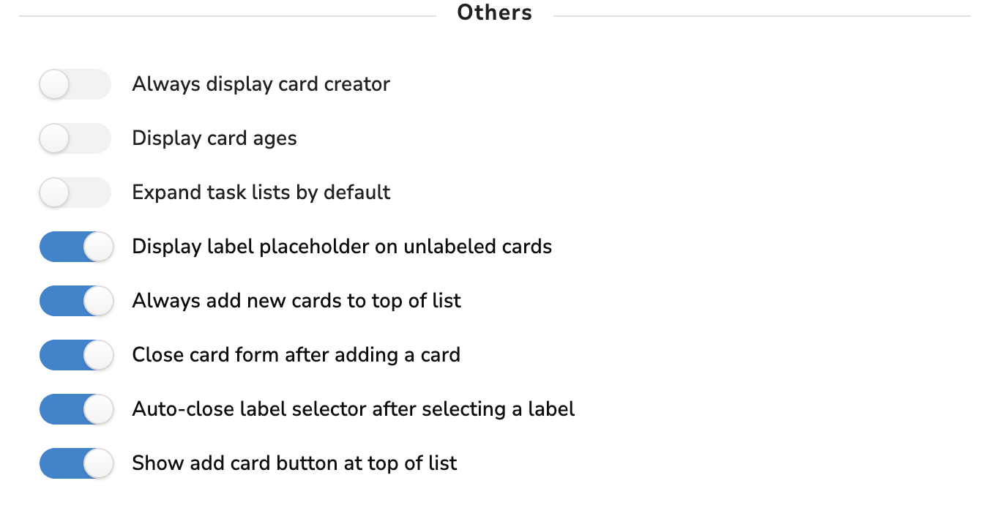
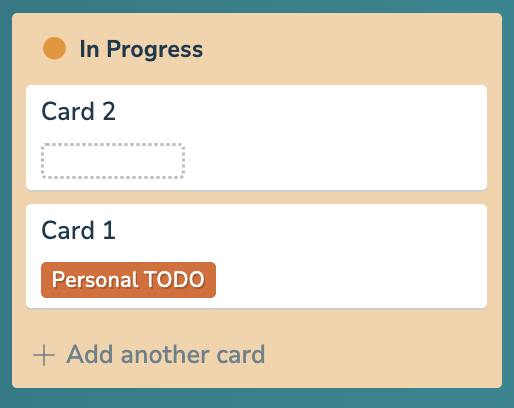
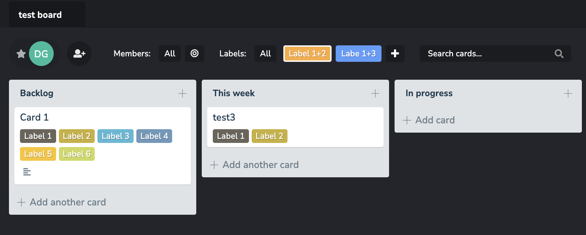
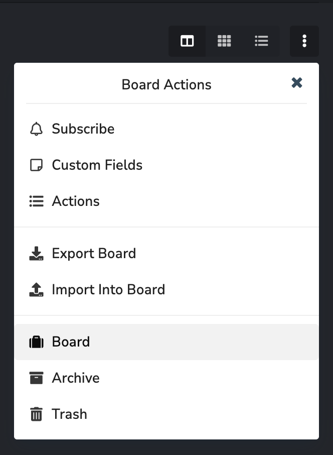

# PLANKA

## Doug's Fork

I forked Planka to add several customizations. Each of the following is controlled by a board-level preference setting that can be enabled for custom behavior or disabled for standard Planka behavior.

1. Always create new cards at the top of a column.
2. Only create one card at a time. Don't open a new blank card after you press Enter.
3. Put a label placeholder by default on a card.
4. When you click the label placeholder, the label context menu opens rather than the edit card dialog.
5. Show a create new card button at the top of the column.

These are the additional preferences.

And this is what the label placeholder and add a card button look like.

I also added a bunch of custom colors for labels, and I added the ability to create custom filter buttons (for the purpose of grouping labels for bulk filtering).

And I added Board Export and Board Import. Export includes the Custom Filters featured described above. Import is additive. It doesn't replace anything that's already there, including columns (lists) that already exist. NOTE: this feature is lightly tested so far, but I don't use all of the board features, so it's possible I missed something.

Finally, I added the ability to collapse the board selector bar for better screen usage on small laptop screens. See the little chevron on the right side:

## Key Features

- **Collaborative Kanban Boards:** Create projects, boards, lists, cards, and manage tasks with an intuitive drag-and-drop interface
- **Real-Time Updates:** Instant syncing across all users, no refresh needed
- **Rich Markdown Support:** Write beautifully formatted card descriptions with a powerful markdown editor
- **Flexible Notifications:** Get alerts through 100+ providers, fully customizable to your workflow
- **Seamless Authentication:** Single sign-on with OpenID Connect integration
- **Multilingual & Easy to Translate:** Full internationalization support for a global audience

## How to Deploy

PLANKA is easy to install using multiple methods - learn more in the [installation guide](https://docs.planka.cloud/docs/welcome/).

For configuration and environment settings, see the [configuration section](https://docs.planka.cloud/docs/category/configuration/).

Interested in a hosted or [Pro version](https://planka.app/pro) of PLANKA? Check out the pricing on our [website](https://planka.app/pricing).

## Notes App

A testing version of the Notes app is now available on multiple platforms:

- **iOS:** Join the [TestFlight](https://testflight.apple.com/join/5eJqTaJW) to try the app
- **Windows & Android:** [Download the app](https://planka-notes.hillerdaniel.de)

## Contact

For any security issues, please do not create a public issue on GitHub - instead, report it privately by emailing [security@planka.group](mailto:security@planka.group).

**Note:** We do NOT offer any public support via email, please use GitHub.

**Join our community:** Get help, share ideas, or contribute on our [Discord server](https://discord.gg/WqqYNd7Jvt).

## License

PLANKA is [fair-code](https://faircode.io) distributed under the [Fair Use License](https://github.com/plankanban/planka/blob/master/LICENSES/PLANKA%20Community%20License%20EN.md) and [PLANKA Pro/Enterprise License](https://github.com/plankanban/planka/blob/master/LICENSES/PLANKA%20Commercial%20License%20EN.md).

- **Source Available:** The source code is always visible
- **Self-Hostable:** Deploy and host it anywhere
- **Extensible:** Customize with your own functionality
- **Enterprise Licenses:** Available for additional features and support

For more details, check the [License Guide](https://github.com/plankanban/planka/blob/master/LICENSES/PLANKA%20License%20Guide%20EN.md).

## Contributing

Found a bug or have a feature request? Check out our [Contributing Guide](https://github.com/plankanban/planka/blob/master/CONTRIBUTING.md) to get started.

For setting up the project locally, see the [development section](https://docs.planka.cloud/docs/category/development/).

**Thanks to all our contributors!**

